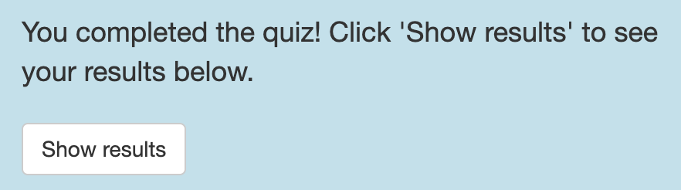

# Krijgsman-MathQuest

## DESCRIPTION
Math Quest is a fun and playful quiz app that allows elementary school children (fourth grade through eighth grade) to practice different parts of math, such as addition, subtraction, multiplication, and division. The app randomly generates math questions adapted to the selected school grade level. The application incorporates gamification and learning strategies to promote and make learning more fun for students and optimize their enjoyment to achieve the best results. For example, students are encouraged to answer all the questions correctly to ‘defeat’ the monster and all incorrectly answered questions will be repeated until correct. The app can be personalized by selecting the grade (math level), setting a name, and choosing the number of questions that they want to practice. 

## HOW TO USE THE APP & EXAMPLE APPLICATION

### Running the app

#### Installation
To install the MathQuest package, run the following command in the console:
```r
devtools::install_github("asarafoglou-ptns/Krijgsman-MathQuest")
```

#### How to run the app
The mathQuest app can be started by running the function runMathQuest() along with the provided ‘name’ and ‘question_count’ arguments. If the user does not specify the arguments within the function, the app will be running using the default arguments of “Superhero” as name and 15 as question_count.
```r
library(MathQuest)
MathQuest::runMathQuest(name = “Bruny”, question_count = 15)
```

#### How to consult the documentation
To consult the documentation of the MathQuest package and the runMathQuest function, run the following command in the console:
```r
??MathQuest()

?runMathQuest()
```

### How to use the app/example application
#### Landing page. 
After starting the app, the user arrives at the landing page and sees the instruction box, a box to select their grade, a calculator button, and a monster with a progress bar above its head. The header displays the app name and superhero cartoons, which help the user defeat the monster during the quest.


#### Instructions. 
First, the user reads the instructions for using the app or playing the game, which are shown in an orange text field.


#### Select grade input. 
The user is then asked to select the grade they are currently in. Under ‘Select your grade’, the user sees a few answer options, ranging from second to sixth grade. 


#### Select button. 
After choosing the grade, the user clicks the ‘Select’ button to confirm their choice. Once the school grade is selected, this button and the select grade input options are blocked. This is implemented to prevent the user from switching between the groups during the quiz and ensure the user can finish the quiz until the end without any problems.


#### Grade information. 
If the user is unsure which grade to choose, they can click on the 'i' icon, after which the information modal will open. The pop-up displays the grades along with the corresponding ages. After reading, the information modal can be closed by pressing 'Close'.


#### Math question. 
Once the user presses ‘Select’, the app generates the specified number of math questions at the selected level. The questions are presented one at a time in the center of the screen. The answer input is shown below the question. Here, the user can type down the answer and press the ‘Submit’ button to check the answer. Correctly answered questions are saved for plotting the performance at the end, while incorrectly answered questions are repeated randomly until the user has responded to all the questions correctly.


#### Feedback. 
After the user clicks the 'Submit' button, the application generates feedback on the given answer to the arithmetic to indicate whether the answer is correct or incorrect.


#### Next question. 
After the feedback is generated, the 'Next Question' button becomes available, which the user needs to click to continue to the next question. The 'Next Question' button becomes available again only after using the 'Submit' button and is blocked after clicking it.


#### Submit. 
This button is only available when the answer to a question has not yet been submitted. After submitting the question, this button is disabled and is only available again after pressing the 'Next Question' button.


#### Progress bar. 
The progress bar is actually a health bar that indicates the life of the “monster". At first, the bar is completely green, and with each correctly answered question, the monster's vitality decreases, and the bar changes to a red color. When all questions are answered correctly (including the repeated ones that were answered incorrectly), the health bar is completely red, and the monster is defeated, i.e., the user has won. The bar does not decrease when questions are answered incorrectly.


#### Game over. 
Since incorrectly answered questions are repeated randomly until all questions are answered correctly, a maximum of 5 errors is allowed to avoid infinite loops within the application. When the user makes 5 errors, the game ends, and the user is shown that it is 'Game over'. They can press the ‘Show results’ button to see their achievement.


#### Show results. 
There are two different situations in which the results can be plotted. For example, the user is asked to click the ‘Show results’ button after correctly answering all questions to see his/her results. In addition, the user is also asked to click the ‘Show results’ button when they have made 5 errors, and it is game over to see how they did.



#### Showing the plots. 
After pressing the ‘Show results’ button, the application generates a plot of the user's performance. The percentage of correctly answered questions on the first attempt is separately displayed for the overall performance and for each operator. Thus, the user can get a good overview of which parts could use additional practice. 


#### Calculator. 
Although the math questions have been developed to promote and improve mental arithmetic, the user has the option of using the built-in calculator. The calculator appears by clicking on ‘Calculator’ and is always available. 


After pressing this button, a calculator modal appears. In this modal, the user specifies both numbers and the corresponding operator. Then, the user clicks 'Calculate', and the application shows the correct answer. After that, the user can press 'Close' to close the calculator modal again. 


